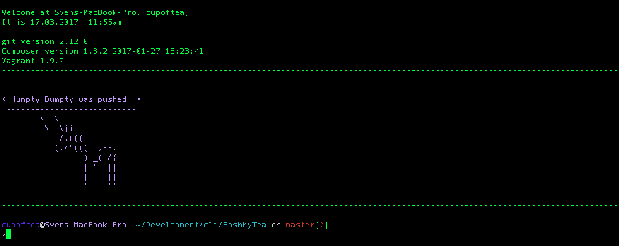

# Bash My Tea

An install script for my most used command line tools & `.bash_profile`.

## Installing

Clone this repo, enter the director and run `sh install.sh`. You may run this script in non-interactive mode by passing the flag `-n` or `--no-interaction`.
Please note that some of the tools installed might still ask interactive questions.

## Overview

### Installed Tools

 - [pip](https://pip.pypa.io)
 - [Homebrew](https://brew.sh)
   - bash_completion
   - git
   - mysql
   - node
   - wget
 - [PHP 7.1](http://www.php.net) (optional)
 - [Composer](https://getcomposer.org) (optional)
   - [phpunit/phpunit](https://phpunit.de)
   - [phpspec/phpspec](http://www.phpspec.net)
   - [laravel/installer](https://laravel.com)
 - [Node.js](https://nodejs.org)
   - [Bower](https://bower.io) (optional)
   - [Gulp](http://gulpjs.com) (optional)
   - [Grunt](https://gruntjs.com) (optional)
 - [Bashmarks](https://www.huyng.com/projects/bashmarks)
 - [thefuck](https://github.com/nvbn/thefuck)
 - [Fortune](https://www.wikiwand.com/en/Fortune_(Unix)) & [Cowsay](https://github.com/cupOfTea696/cowsay) (optional)
 - [hr](https://github.com/LuRsT/hr)
 - [Jekyll](https://jekyllrb.com) (optional)
 - [Laravel Homestead](https://laravel.com/docs/homestead) (optional)
   - [brew cask](https://github.com/caskroom/homebrew-cask)
   - [Vagrant](https://www.vagrantup.com)
   - [VirtualBox](https://www.virtualbox.org/)

### Generated Directories

 - `~/Development`
 - `~/Downloads/_attachments`

### Bashmarked Directories

These will only be bashmarked if you chose to install bashmarks.

 - `~/Development`: projects
 - `~/Documents`: documents
 - `~/Downloads`: downloads

### Git Configuration

 - `color.ui`: `auto`
 - `core.editor`: `nano`
 - `alias.forget`: `'!git rm -r --cached . && git add . && git commit -am "Remove ignored files"'`

### Aliases

#### Sudo

 - `fucking`
 - `pls`

#### Quick Navigation & Editing

 - `..`: Go up one directory
 - `...`: Go up two directories
 - `.2` - `.6`: Go up the respective number of directories
 - `b`: Return to the previous directory
 - `abs`: Convert relative path to absolute path
 - `lna`: Link, converting relative directories to absolute ones
 - `edit`: Edit a file using Brackets
 - `finder`: Open a path in Finder
 - `hosts`: Edit the hosts file using `nano`
 - `profile`: Edit your `.bash_profile`
 - `r`: Reload your `.bash_profile`
 - `killfinder`: Restart Finder
 - `showhidden`: Show hidden files in Finder
 - `hidehidden`: Hide hidden files in Finder

#### Homestead
 - `homestead`: Forwards Vagrant commands to the Homestead box
 - `h`: `homestead up`
 - `h:up`: `homestead up --provision`
 - `h:h`: `homestead halt`
 - `h:s`: `homestead ssh`
 - `h:p`: `homestead provision`
 - `h:e`: `edit ~/Homestead/Homestead.yaml`
 - `h:u`: `rm ~/.vagrant.d/tmp/*; homestead box update`

## Screenshot

